# fleet-pulse-api

> Backend REST API for GPS pulse dispatching to the QSolutions/DigiHaul logistics platform.
> Replaces a JavaFX desktop application currently in production.

---

## Purpose and System Context

`fleet-pulse-api` manages the automated dispatch of GPS position pulses for a fleet of 5 transport
units to the **QSolutions SOAP endpoint** on a 15-minute cycle. Each pulse carries the unit's
real-time coordinates, unit identity, and session timestamps.

The system replaces a working **JavaFX + Ant desktop application** (`GPSWebServicesClient`) that has
been in production. The replacement preserves all existing pulse behavior while adding a REST API,
role-based access control, and a real GPS coordinate pipeline via **Traccar Client** on operator
Android devices.

A **React frontend** is planned as a separate project once the API contract is stable.

---

## Technology Stack

| Concern | Choice | Version |
|---|---|---|
| Runtime | Java LTS | 21 |
| Framework | Spring Boot | 3.x |
| Build | Maven | 3.9+ |
| Database | MySQL | 8.0+ |
| Schema migrations | Flyway | bundled with Spring Boot |
| Security | Spring Security + JWT | — |
| SOAP transport | JAX-WS Metro (`jaxws-rt`) | 4.0.2 |
| SOAP stubs | Generated via `wsimport` | — |
| GPS provider — Phase 1 | Manual input | — |
| GPS provider — Phase 2 | Traccar Client (Android) | — |
| Testing | JUnit 5 + Mockito | — |
| IDE | IntelliJ IDEA | 2026.1.1 |

---

## Architecture

### Hexagonal Architecture (Ports & Adapters)

The system follows strict **Hexagonal Architecture**. The `domain/` and `application/` layers have
zero dependencies on Spring, JPA, JAX-WS, or any infrastructure framework. All I/O crosses the
domain boundary only through typed ports.

```mermaid
flowchart LR
    subgraph IB["Inbound Adapters"]
        direction TB
        WEB["UnitController\nPulseController\nTraccarPositionController\nProviderTestController"]
        SCH["PulseSchedulerService\n@Scheduled · 15 min"]
    end

    subgraph HEX["Application + Domain (Hexagon)"]
        direction TB
        DPI["Driving Ports\n─────────────────\nSendPulseUseCase\nTestProviderUseCase\nManageUnitUseCase\nConfigureScheduleUseCase"]
        DOM["Domain\n─────────────────\nUnit  ·  GpsReading\nScheduledPulse  ·  Role\nFLEET_TIMEZONE"]
        DPO["Driven Ports\n─────────────────\nGpsCoordinateProvider\nPulseSender\nUnitRepository\nUserRepository"]
    end

    subgraph OB["Outbound Adapters"]
        direction TB
        GPS["GPS Adapters\nManualCoordinateAdapter\nTraccarCoordinateAdapter\n+ GpsPositionCache"]
        SOAP["QSolutionsSoapAdapter\n→ QSolutions SOAP endpoint"]
        PERS["JPA Adapters\nUnitJpaAdapter · UserJpaAdapter\n→ MySQL"]
    end

    IB --> DPI
    DPI --- DOM
    DOM --- DPO
    DPO --> OB
```



**Enforcement rule:** Nothing inside `domain/` or `application/` may import from `infrastructure/`,
Spring, or JPA. Verify this constraint at build time with
[ArchUnit](https://www.archunit.org/).

---

### Package Structure

```
com.fleetpulse.api
├── domain/
│   ├── model/
│   │   ├── Unit.java                        # aggregate root
│   │   ├── GpsReading.java                  # immutable value object — validates in constructor
│   │   ├── ScheduledPulse.java              # value object, assembled at dispatch, never persisted
│   │   └── Role.java                        # enum: ADMIN, USER
│   └── exception/
│       ├── UnitNotFoundException.java
│       ├── InvalidCoordinateException.java  # thrown by GpsReading constructor
│       └── GpsProviderUnavailableException.java
│
├── application/
│   ├── port/
│   │   ├── in/                              # driving ports (use cases)
│   │   │   ├── SendPulseUseCase.java
│   │   │   ├── TestProviderUseCase.java
│   │   │   ├── ManageUnitUseCase.java
│   │   │   └── ConfigureScheduleUseCase.java
│   │   └── out/                             # driven ports (infrastructure contracts)
│   │       ├── GpsCoordinateProvider.java
│   │       ├── PulseSender.java
│   │       ├── UnitRepository.java
│   │       └── UserRepository.java
│   └── service/
│       ├── PulseOrchestrationService.java
│       ├── UnitManagementService.java
│       └── ProviderTestService.java
│
└── infrastructure/
    ├── adapter/
    │   ├── in/
    │   │   └── web/
    │   │       ├── UnitController.java
    │   │       ├── PulseController.java
    │   │       ├── TraccarPositionController.java   # receives GPS push from Traccar Client
    │   │       ├── ProviderTestController.java
    │   │       └── dto/
    │   └── out/
    │       ├── soap/
    │       │   └── QSolutionsSoapAdapter.java
    │       ├── gps/
    │       │   ├── ManualCoordinateAdapter.java
    │       │   └── TraccarCoordinateAdapter.java
    │       ├── cache/
    │       │   └── GpsPositionCache.java            # ConcurrentHashMap<String, GpsReading>
    │       └── persistence/
    │           ├── UnitJpaAdapter.java
    │           ├── UserJpaAdapter.java
    │           └── entity/
    │               ├── UnitEntity.java
    │               └── UserEntity.java
    ├── scheduler/
    │   └── PulseSchedulerService.java
    └── config/
        ├── SecurityConfig.java
        ├── SchedulerConfig.java
        └── GpsProviderConfig.java              # selects active GpsCoordinateProvider
```

---

## Domain Model

### FLEET_TIMEZONE

```java
// domain/model/FleetConstants.java
ZoneId FLEET_TIMEZONE = ZoneId.of("America/Mexico_City");
```

All `ZonedDateTime` values in the system use this constant. `XMLGregorianCalendar` instances
produced for the SOAP payload carry the explicit `America/Mexico_City` UTC offset rather than
relying on the JVM default timezone. This is a deliberate change from the production desktop app,
which used the JVM default implicitly.

---

### `Unit` — aggregate root

| Field | Type | Constraints | Description |
|---|---|---|---|
| `numUnidad` | `String` | non-null, unique | Natural key. Must match QSolutions nomenclature exactly (e.g. `Peugeot`, `Tr-02`). |
| `horarioFijo` | `boolean` | — | If `true`, only `ADMIN` may modify the schedule. |
| `horaInicio` | `LocalTime` | non-null | Start of active GPS window (inclusive). |
| `horaFin` | `LocalTime` | non-null | End of active GPS window (inclusive). |
| `trackingNumber` | `String` | nullable | `null` → resolved to `env.QSOLUTIONS_TRACKING_NUMBER` at dispatch time. Set only when the unit requires a value distinct from the global default. |
| `active` | `boolean` | — | Soft enable/disable. Inactive units are skipped by the scheduler without logging. |

**Domain method:**

```
boolean isWithinActiveWindow(LocalTime now)
```

Returns `true` if `now` falls within `[horaInicio, horaFin]` (both bounds inclusive). Applies to
**all units** regardless of `horarioFijo`. Inactive units short-circuit to `false` before the
window check is evaluated.

---

### `GpsReading` — immutable value object

| Field | Type | Description |
|---|---|---|
| `numUnidad` | `String` | Identifies which unit this reading belongs to. |
| `latitud` | `BigDecimal` | Validated: must be in `[-90, 90]`. |
| `longitud` | `BigDecimal` | Validated: must be in `[-180, 180]`. |
| `fechaHoraEvento` | `ZonedDateTime` | Timestamp when the GPS fix was acquired at the source. Zone: `FLEET_TIMEZONE`. |
| `providerType` | `ProviderType` | `MANUAL` or `TRACCAR`. |

**Constructor validation** — throws `InvalidCoordinateException` if:

- `latitud` is outside `[-90, 90]`
- `longitud` is outside `[-180, 180]`
- Both `latitud` and `longitud` are exactly `0.0` — indicates GPS not yet locked on device

Adapters must not bypass these checks. A `GpsReading` instance is a trusted object once
constructed.

---

### `ScheduledPulse` — value object, assembled at dispatch, never persisted

| Field | Type | Description |
|---|---|---|
| `unit` | `Unit` | The unit being dispatched. |
| `gpsReading` | `GpsReading` | The coordinate reading for this pulse. |
| `fechaRecepcion` | `ZonedDateTime` | Server-side dispatch timestamp — always `ZonedDateTime.now(FLEET_TIMEZONE)` inside `PulseOrchestrationService`. |
| `effectiveTrackingNumber` | `String` | `unit.trackingNumber` if non-null; otherwise `env.QSOLUTIONS_TRACKING_NUMBER`. Resolved by `PulseOrchestrationService`. |

`PulseOrchestrationService` is the only place that assembles a `ScheduledPulse`. No controller or
scheduler constructs one directly.

---

### `Role` — enum

```
ADMIN  full access: unit management, schedule changes, user management
USER   restricted: pulse dispatch and unit status read-only
```

---

## Ports

### Driving Ports (`application/port/in/`)

**`SendPulseUseCase`**
Triggers a real GPS pulse for a given unit. Fetches coordinates from the active
`GpsCoordinateProvider`, assembles a `ScheduledPulse`, and calls `PulseSender`. Used by both the
scheduler (15-minute cycle) and the force-dispatch endpoint (`POST /api/units/{numUnidad}/pulse/force`).

**`TestProviderUseCase`**
Verifies that the active GPS provider is reachable and returns a valid `GpsReading`. **MUST NEVER
call `PulseSender` under any circumstance.** This isolation is enforced in `ProviderTestService`,
not by convention. Tests must assert that no `PulseSender` invocation occurs when this use case
executes.

**`ManageUnitUseCase`**
CRUD for `Unit` entities. ADMIN only.

**`ConfigureScheduleUseCase`**
Updates `horaInicio` / `horaFin` for a unit. ADMIN always. USER only if
`unit.horarioFijo == false` — the service must reject schedule changes to fixed-schedule units
when called by USER role.

---

### Driven Ports (`application/port/out/`)

**`GpsCoordinateProvider`**

```
GpsReading getCoordinates(String numUnidad) throws GpsProviderUnavailableException
boolean    isAvailable(String numUnidad)
```

The central extensibility point. The application is unaware of whether coordinates came from
manual input, Traccar, or any future hardware provider. `isAvailable()` is called exclusively by
`TestProviderUseCase`. Adding a new provider means implementing this interface and registering it
in `GpsProviderConfig` — no changes to domain or application layer.

**`PulseSender`**

```
void send(ScheduledPulse pulse) throws PulseSendException
```

Abstracts SOAP transport. If QSolutions changes protocol, only `QSolutionsSoapAdapter` changes.
When the endpoint returns `Protocolo.isProcessed() == false`, the adapter wraps
`Protocolo.getMessage()` in a `PulseSendException`.

**`UnitRepository`** / **`UserRepository`**
Standard persistence contracts. Return domain objects only — never JPA entities. The application
layer has no knowledge of `UnitEntity` or `UserEntity`.

---

## GPS Coordinate Pipeline

### How Traccar Client Works

Traccar Client is a **push-based** GPS reporting application. It does not expose a local HTTP API
on the device. The device sends position updates to the server — the server cannot query the device.

Each operator installs Traccar Client on their Android device and configures it with:

| Setting | Value |
|---|---|
| Server URL | `http://{public-domain}/api/gps/position` |
| Device identifier | Unit `numUnidad` exactly as stored in DB (e.g. `Peugeot`) |
| Reporting interval | 60 seconds |
| Accuracy | High |
| Protocol | OsmAnd (default) |

Traccar Client transmits position updates as an HTTP GET request:

```
GET /api/gps/position?id=Peugeot&lat=19.432608&lon=-99.133209&timestamp=1715600000&accuracy=5&speed=0&bearing=0
```

`TraccarPositionController` receives this request, constructs a `GpsReading` (coordinate
validation occurs in the constructor), and stores it in `GpsPositionCache`. This endpoint requires
**no authentication** — Traccar Client cannot send auth headers in standard OsmAnd mode.

> **Security posture of `/api/gps/position`:** The endpoint is intentionally public. Its only
> accepted effect is storing a coordinate by unit ID. Coordinates that fail domain validation are
> rejected before storage. Unit IDs that do not exist in the DB are silently discarded. The
> endpoint accepts no other parameters and performs no other action.

---

### Coordinate Staleness Policy

`GpsPositionCache` holds the **latest** `GpsReading` per unit keyed by `numUnidad`. Before each
pulse, `PulseSchedulerService` evaluates three skip conditions in order:

| Condition | Log entry |
|---|---|
| Unit outside `[horaInicio, horaFin]` | `SKIPPED_OUT_OF_WINDOW` |
| No coordinate in cache for this unit | `SKIPPED_NO_COORDINATES` |
| Coordinate age > `GPS_MAX_COORDINATE_AGE_SECONDS` (default: 300) | `SKIPPED_STALE` |

All skip conditions are logged at `INFO` level with the unit name and reason. Only the fourth
outcome — all checks pass — results in a call to `PulseOrchestrationService`.

---

### Traccar Data Flow

```mermaid
sequenceDiagram
    participant Phone as Android Phone<br/>(Traccar Client)
    participant Ctrl as TraccarPositionController
    participant Cache as GpsPositionCache
    participant Sched as PulseSchedulerService<br/>@Scheduled · 15 min
    participant Orch as PulseOrchestrationService
    participant Repo as UnitRepository
    participant SOAP as QSolutionsSoapAdapter
    participant QS as QSolutions Endpoint

    Phone->>Ctrl: GET /api/gps/position<br/>?id=Peugeot&lat=19.43&lon=-99.13&timestamp=...
    Note over Ctrl: No auth · public endpoint
    Ctrl->>Ctrl: new GpsReading(...) — validates coords
    Ctrl->>Cache: store(numUnidad, GpsReading)

    loop Every 15 minutes
        Sched->>Repo: findAll()
        Repo-->>Sched: List&lt;Unit&gt;

        loop For each Unit
            Sched->>Sched: unit.isWithinActiveWindow(now)

            alt outside window
                Sched->>Sched: log SKIPPED_OUT_OF_WINDOW
            else within window
                Sched->>Cache: getLatest(numUnidad)

                alt no coordinate in cache
                    Sched->>Sched: log SKIPPED_NO_COORDINATES
                else coordinate age > GPS_MAX_COORDINATE_AGE_SECONDS
                    Sched->>Sched: log SKIPPED_STALE
                else fresh coordinate
                    Sched->>Orch: sendPulse(unit, gpsReading)
                    Orch->>Orch: assemble ScheduledPulse<br/>resolve effectiveTrackingNumber
                    Orch->>SOAP: send(ScheduledPulse)
                    SOAP->>QS: receiveGPSInformationObjeto(GPSInfo)
                    QS-->>SOAP: Protocolo(isProcessed, message)
                    alt isProcessed == false
                        SOAP-->>Orch: throws PulseSendException(message)
                    else success
                        SOAP-->>Orch: void
                    end
                end
            end
        end
    end
```

---

## SOAP Payload Specification

### Fields sent on every pulse

| XML element | XSD required | Source | Notes |
|---|---|---|---|
| `Username` | no | `env.QSOLUTIONS_USERNAME` | Fixed per deployment |
| `Password` | no | `env.QSOLUTIONS_PASSWORD` | Fixed per deployment |
| `Proveedor` | no | `env.QSOLUTIONS_PROVEEDOR` | Value: `Digi-Haul` |
| `NumUnidad` | no | `unit.numUnidad` | e.g. `Peugeot`, `Tr-02` |
| `Latitud` | **yes** | `gpsReading.latitud` | Dynamic per pulse |
| `Longitud` | **yes** | `gpsReading.longitud` | Dynamic per pulse |
| `Trackingnumber` | no | `unit.trackingNumber` → fallback `env.QSOLUTIONS_TRACKING_NUMBER` | Global default: `"1"` |
| `FechaHoraEvento` | **yes** | `gpsReading.fechaHoraEvento` | GPS fix timestamp from device |
| `FechaRecepcion` | **yes** | `scheduledPulse.fechaRecepcion` | Server dispatch timestamp |

### Fields intentionally omitted

`parametrosAdicionales` · `NumRemolque` · `Velocidad` · `Placas` · `Ubicacion` · `Ruta` · `BOL` · `Observaciones`

All carry `minOccurs="0"` in the XSD. They are left as `null` and absent from the serialized XML.

### Timestamp encoding

`XMLGregorianCalendar` values are produced from `ZonedDateTime` instances using `FLEET_TIMEZONE`
(`America/Mexico_City`). The UTC offset is encoded explicitly in the calendar object, ensuring
consistent timestamps regardless of the JVM's default timezone on the deployment host.

### SOAP dependency and stub generation

```xml
<!-- pom.xml — runtime dependency -->
<dependency>
    <groupId>com.sun.xml.ws</groupId>
    <artifactId>jaxws-rt</artifactId>
    <version>4.0.2</version>
</dependency>

<!-- pom.xml — stub generation plugin -->
<plugin>
    <groupId>com.sun.xml.ws</groupId>
    <artifactId>jaxws-maven-plugin</artifactId>
    <version>4.0.2</version>
    <executions>
        <execution>
            <goals><goal>wsimport</goal></goals>
            <configuration>
                <wsdlFiles>
                    <wsdlFile>src/main/resources/wsdl/ReceiveGPSInfo.wsdl</wsdlFile>
                </wsdlFiles>
                <packageName>org.tempuri</packageName>
                <sourceDestDir>
                    ${project.build.directory}/generated-sources/wsimport
                </sourceDestDir>
            </configuration>
        </execution>
    </executions>
</plugin>
```

The WSDL is stored at `src/main/resources/wsdl/ReceiveGPSInfo.wsdl`. Stubs are generated into
`target/generated-sources/wsimport` and are **not committed to source control**. The migration
from the production app's `javax.*` stubs to `jakarta.*` is handled automatically by the plugin.

> Do not regenerate from the live WSDL endpoint without first verifying the contract is unchanged.

---

## Security

### JWT Configuration

| Token | Expiry | Transport |
|---|---|---|
| Access token | 15 minutes | `Authorization: Bearer` header |
| Refresh token | 7 days | Secure client storage (implementation: React frontend decision) |

### Endpoint Authorization Matrix

| Endpoint | ADMIN | USER | Public |
|---|---|---|---|
| `POST /api/auth/login` | — | — | ✓ |
| `POST /api/auth/refresh` | — | — | ✓ |
| `GET /api/gps/position` | — | — | ✓ (Traccar push) |
| `GET /api/units` | ✓ | ✓ | — |
| `POST /api/units` | ✓ | — | — |
| `PUT /api/units/{id}` | ✓ | — | — |
| `DELETE /api/units/{id}` | ✓ | — | — |
| `PUT /api/units/{id}/schedule` | ✓ | ✓ (only if `horarioFijo=false`) | — |
| `POST /api/units/{numUnidad}/pulse/force` | ✓ | ✓ | — |
| `GET /api/units/{numUnidad}/pulse/test` | ✓ | ✓ | — |

---

## Database

### Production Tables — `V1__schema.sql`

```sql
CREATE TABLE units (
    id              BIGINT       AUTO_INCREMENT PRIMARY KEY,
    num_unidad      VARCHAR(100) NOT NULL UNIQUE,
    horario_fijo    BOOLEAN      NOT NULL DEFAULT FALSE,
    hora_inicio     TIME         NOT NULL,
    hora_fin        TIME         NOT NULL,
    tracking_number VARCHAR(255) NULL,
    active          BOOLEAN      NOT NULL DEFAULT TRUE,
    created_at      DATETIME     NOT NULL DEFAULT CURRENT_TIMESTAMP,
    updated_at      DATETIME     NOT NULL DEFAULT CURRENT_TIMESTAMP
                                 ON UPDATE CURRENT_TIMESTAMP
);

CREATE TABLE users (
    id            BIGINT       AUTO_INCREMENT PRIMARY KEY,
    username      VARCHAR(100) NOT NULL UNIQUE,
    password_hash VARCHAR(255) NOT NULL,
    role          ENUM('ADMIN','USER') NOT NULL,
    active        BOOLEAN      NOT NULL DEFAULT TRUE,
    created_at    DATETIME     NOT NULL DEFAULT CURRENT_TIMESTAMP
);
```

`tracking_number NULL` means the global env var is used at dispatch time. Units and users have no
foreign key relationship. Units are independent entities; there is no user-to-unit assignment in
the data model.

### Initial Fleet Seed — `V2__seed_units.sql`

```sql
INSERT INTO units (num_unidad, horario_fijo, hora_inicio, hora_fin) VALUES
    ('Peugeot',  TRUE,  '06:00:00', '16:00:00'),
    ('Kangoo',   TRUE,  '07:00:00', '17:00:00'),
    ('Tr-02',    TRUE,  '07:00:00', '17:00:00'),
    ('Attitude', FALSE, '08:00:00', '18:00:00'),
    ('Sentra',   FALSE, '08:00:00', '18:00:00');
```

`num_unidad` values must match QSolutions nomenclature exactly as registered in their system. Do
not modify these values without confirming with QSolutions.

### Deferred Table — `V3__pulse_log.sql` — Phase 8 only

The following schema is defined here for completeness. **Do not create this table before Phase 8.**
Creating it without a consumer adds schema overhead with no benefit.

```sql
-- Create in V3__pulse_log.sql when React frontend is built (Phase 8)
CREATE TABLE pulse_log (
    id         BIGINT        AUTO_INCREMENT PRIMARY KEY,
    num_unidad VARCHAR(100)  NOT NULL,
    status     ENUM('SENT','SKIPPED_STALE','SKIPPED_OUT_OF_WINDOW',
                    'SKIPPED_NO_COORDINATES','REJECTED','ERROR') NOT NULL,
    lat        DECIMAL(10,7) NULL,
    lon        DECIMAL(10,7) NULL,
    provider   ENUM('MANUAL','TRACCAR') NULL,
    message    VARCHAR(500)  NULL,
    created_at DATETIME      NOT NULL
);
```

---

## Environment Variables

No credentials appear in source code or in any `application.properties` committed to version
control. All sensitive and deployment-specific values are supplied at runtime.

| Variable | Description | Default / Example |
|---|---|---|
| `QSOLUTIONS_USERNAME` | QSolutions SOAP authentication | `LEURRV_DH` |
| `QSOLUTIONS_PASSWORD` | QSolutions SOAP authentication | — |
| `QSOLUTIONS_PROVEEDOR` | Provider name sent in every pulse | `Digi-Haul` |
| `QSOLUTIONS_TRACKING_NUMBER` | Global default tracking number | `1` |
| `JWT_SECRET` | HS256 signing key — minimum 256-bit entropy | — |
| `JWT_ACCESS_EXPIRY_SECONDS` | Access token lifetime | `900` |
| `JWT_REFRESH_EXPIRY_SECONDS` | Refresh token lifetime | `604800` |
| `SPRING_DATASOURCE_URL` | JDBC connection string | `jdbc:mysql://localhost:3306/fleet_pulse` |
| `SPRING_DATASOURCE_USERNAME` | Database user | — |
| `SPRING_DATASOURCE_PASSWORD` | Database password | — |
| `GPS_MAX_COORDINATE_AGE_SECONDS` | Staleness threshold for cached coordinates | `300` |

---

## Architectural Decisions

| Decision | Resolution | Rationale |
|---|---|---|
| Architecture style | Hexagonal (Ports & Adapters) | Domain is testable without any infrastructure; SOLID enforced structurally |
| GPS provider model | Push — device sends to this API | Traccar Client has no local HTTP API to poll |
| Coordinate cache | `ConcurrentHashMap<String, GpsReading>` in memory | No Redis dependency needed for a 5-unit fleet |
| Staleness threshold | 300 s, configurable via env var | Prevents stale coordinates reaching QSolutions if phone loses signal |
| Scheduler design | Single global `@Scheduled` tick every 15 minutes | Reads live DB state on each tick; schedule changes take effect immediately without restart |
| Per-unit schedulers | Explicitly rejected | Over-engineering for 5 units |
| User-to-unit assignment | Explicitly rejected | Units are independent entities; any authenticated user manages all |
| `TrackingNumber` | Env var global default; nullable `Unit` field for future per-unit override | Zero migration required when client needs per-unit values |
| `FechaHoraEvento` | GPS device timestamp (`gpsReading.fechaHoraEvento`) | Semantically correct — when the fix was acquired at the source |
| `FechaRecepcion` | Server dispatch timestamp (`ZonedDateTime.now(FLEET_TIMEZONE)`) | Semantically correct — when this system sent the pulse |
| Timezone | `FLEET_TIMEZONE = ZoneId.of("America/Mexico_City")` — explicit constant in domain | Replaces the implicit JVM default timezone dependency in the production desktop app |
| Coordinate validation | `GpsReading` constructor — domain concern | Rejects invalid range and `0.0, 0.0` (GPS not locked) before data reaches any adapter |
| Force pulse | `POST /api/units/{numUnidad}/pulse/force` — real SOAP dispatch | Maps to production `Forzar pulso` button; calls `SendPulseUseCase`, not `TestProviderUseCase` |
| `TestProviderUseCase` isolation | `ProviderTestService` never calls `PulseSender` | Dry-run must be safe to call at any time without side effects to QSolutions |
| SOAP library | JAX-WS Metro `jaxws-rt:4.0.2` | Jakarta EE 10 compatible; direct successor to stubs used in production |
| Stub generation | `wsimport` from WSDL → `target/generated-sources` | Not source-controlled; `javax.*` → `jakarta.*` handled automatically by plugin |
| JWT | Access 15 min / Refresh 7 days | Standard for stateless REST API consumed by a React SPA |
| Pulse result logging | Phase 1 — SLF4J/Logback only | No frontend consumer until Phase 8; `pulse_log` table deferred |
| Browser Geolocation API | Deferred — future `GpsCoordinateProvider` implementation | Requires open browser tab; not reliable for field operators |
| DB relations | None between units and users | Units are independent; no assignment model |
| JWT algorithm | HS256 | Single service — no cross-service token verification required. Migrate to RS256 when microservices are introduced |
| Refresh token storage | DB table (refresh_tokens) | Survives restarts, enables revocation. Stateless approach rejected — logout must be real |
| Token revocation | Redis blacklist with TTL | Avoids DB query on every request. TTL matches access token expiry. Failover strategy: fail closed |

### Behavioral Change from Production

> **Manual-schedule units now expire at `horaFin`.**

In the production desktop app (`UnitScheduler`), units with `horarioFijo=false` (Attitude, Sentra)
never expire — `haExpirado()` returns `false` unconditionally for them, and operators stop them
manually.

In `fleet-pulse-api`, `Unit.isWithinActiveWindow(LocalTime now)` applies uniformly to **all
units**, including manual-schedule ones. After `horaFin`, pulses are skipped with
`SKIPPED_OUT_OF_WINDOW`. Operators who need to extend a session must update `horaFin` via the API
before the window closes.

---

## Build Order

Each phase must be complete and validated before the next begins. No phase is optional; no phase
may be skipped.

| Phase | Scope | Exit Condition |
|---|---|---|
| **1** | Domain model (`Unit`, `GpsReading`, `ScheduledPulse`, `Role`, `FLEET_TIMEZONE`) + all port interfaces. Pure Java — no Spring, no JPA, no frameworks. | `GpsReading` rejects invalid coordinates and `0.0, 0.0`; `Unit.isWithinActiveWindow()` is correct; all tests pass with no Spring context loaded. |
| **2** | Flyway migrations (V1 schema + V2 seed) + JPA entities + `UnitJpaAdapter` + `UserJpaAdapter`. | 5 units seed correctly; repository adapters return domain objects; DB round-trip validated. |
| **3** | Spring Security + JWT (login, token generation, refresh) + User CRUD. | ADMIN and USER roles enforce the endpoint authorization matrix. No endpoint is reachable without a valid token except `/api/auth/*`. |
| **4** | SOAP adapter — `wsimport` stub regeneration + `QSolutionsSoapAdapter`. | Stubs compile under Java 21 with `jakarta.*` namespace. `QSolutionsSoapAdapter.send()` delivers a real pulse to QSolutions and receives `Protocolo.isProcessed() == true`. **This is the highest-risk phase. Validate against the live endpoint immediately. Do not proceed to Phase 5 until this is confirmed.** |
| **5** | `ManualCoordinateAdapter` + `PulseOrchestrationService` + global `@Scheduled` tick + `POST /api/units/{numUnidad}/pulse/force`. | Pulses dispatch on the 15-minute cycle for active units within their window. Force-dispatch endpoint works. Skip conditions (`SKIPPED_OUT_OF_WINDOW`, `SKIPPED_NO_COORDINATES`) log correctly. **Production replacement milestone — see below.** |
| **6** | `TraccarPositionController` + `GpsPositionCache` + `TraccarCoordinateAdapter`. | Controller receives Traccar OsmAnd GET, constructs valid `GpsReading`, stores in cache. `TraccarCoordinateAdapter.getCoordinates()` returns cache contents. `SKIPPED_STALE` fires after 300 s without a refresh. Full flow tested with Mockito before real devices. |
| **7** | `UnitController` + `ProviderTestController` + `TestProviderUseCase` dry-run endpoint. | All endpoints in the authorization matrix respond correctly. `GET /api/units/{numUnidad}/pulse/test` returns a `GpsReading` with zero `PulseSender` invocations (verified in tests). API contract is stable for React consumption. |
| **8** | React frontend + `V3__pulse_log.sql` Flyway migration. | Deferred. Begins only after Phase 7 is stable in a deployed environment. |

### Production Replacement Milestone — End of Phase 5

At the end of Phase 5, `GPSWebServicesClient` (JavaFX desktop app) can be shut down and
`fleet-pulse-api` takes over GPS pulse dispatching with zero interruption to the QSolutions
endpoint. Phases 6–8 are additive and do not affect core dispatch behavior.

Until Phase 6 is complete, operators continue entering coordinates manually — the same workflow
as the current desktop app's coordinate input, now via the REST API instead of the UI.
